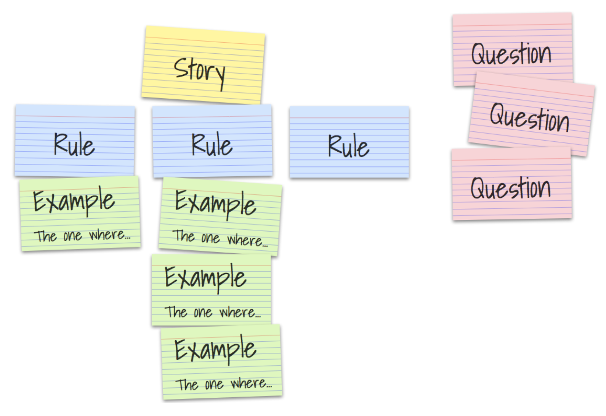

## Table of Contents <!-- omit in toc -->
1. [Introduction](#introduction)
2. [Why Behavior-driven development?](#why-behavior-driven-development)
3. [From TDD to BDD](#from-tdd-to-bdd)
4. [The Principles of Behavior-driven development](#the-principles-of-behavior-driven-development)
   1. [Examples and Business Rules](#examples-and-business-rules)
   2. [Scenarios, the Gherkin Language and Working Software](#scenarios-the-gherkin-language-and-working-software)
   3. [Specification - a Contract?](#specification---a-contract)
   4. [Roles and Responsibilities](#roles-and-responsibilities)
5. [How to do BDD right](#how-to-do-bdd-right)
   1. [How to write good scenarios/examples](#how-to-write-good-scenariosexamples)
   2. [Requirement Workshops](#requirement-workshops)
   3. [The Tools of BDD](#the-tools-of-bdd)
6. [Evaluation of BDD](#evaluation-of-bdd)
   1. [Collaboration](#collaboration)
   2. [Business value](#business-value)
   3. [Documentation](#documentation)
   4. [Behavioral Tests](#behavioral-tests)
   5. [Compatibility](#compatibility)
   6. [Limitations](#limitations)
7. [Approaching BDD](#approaching-bdd)
8. [TODO: Conclusion](#todo-conclusion)
9. [References](#references)

## Introduction
The ultimate goal for every agile process is to turn work into value in a sustainable way. In the context of software engineering, humans automate solutions to problems by explaining them in much detail to machines, that do not have a common sense. Thus, the machines can solve the automatable problems and humans can focus on the not automatable tasks: To further explain the right solutions to problems to a machine in the right way. This discipline is software engineering. The result of explaining the right solution to a machine the right way is good software. In all this there are (at least) two major problems:

1. Misunderstandings in inter-human communication

Often communication between people is required before software can be built, because in many cases some people have the skills to explain a solution to a machine, and other people have a deep understanding of the solution itself. The classical approach to to solve this problem is called specification.

2. Perceived functional dissonance of software

Sometimes people think that software works in a certain way but it doesn't. While or after building software, some features might work at some point in time and then break without humans recognizing it. The software might stop (or even worse: not stop) in critical, unexpected moments which can cost, depending on the software, a lot of customers, money or even lifes. The common approach to solve this problem is called quality assurance (QA) and contains testing the software repeatedly.

The effects of these problems need to be discovered. In a waterfall-based approach the feedback cycle closes only after an increment went through specification, implementation and quality assurance, which means, that if any increment went off track, it is discovered at a late point in time.

The fundamental idea of BDD is to focus on the behavior of a software system while moving the solutions to the above mentioned problems, specification and QA, closer together [@nagy2018discovery, p.3]. Thereby, the feedback cycle shortens and off-track increments are harder to produce and less impactful. In this essay I want to elaborate on how BDD leverages this idea into building sustainable software, which principles and tools it uses to do so and to what extent it can be assumed that BDD works.

** Disclaimer ** In this document I separate the terms for software engineering and QA, but it can be the same people practitioning them. The focus is on the discipline itself.

## Why Behavior-driven development?
The annual "State of Agile" report started 2007 and since then provides insights into the application of agile methodologies and practices over a large range of different companies worldwide.
For the 14th State of Agile Report 1121 surveys were collected [@stateOfAgile14, p.5] and for the Report from 2015 even 3880 surveys where collected [@stateOfAgile10, p.2]. The survey is handed out to agile practicioners and executives. It is aimed to be representative in terms of localization, company size and industries and it exists since more than 12 years, therefore it might contain a convincing insight into the employment of BDD, at least among the companies that participated in the survey. This table of percentual BDD employment per year shows a significantly growing application of BDD, especially since 2015. BDD appears to be of growing interest except for 2019.

|      Report       | BDD used by |    BDD listed as     |
| :---------------: | :---------: | :------------------: |
| [@stateOfAgile3]  |     7%      |     agile method     |
| [@stateOfAgile4]  |    None     |   agile technique    |
| [@stateOfAgile5]  |     9%      |   agile technique    |
| [@stateOfAgile6]  |     9%      |   agile technique    |
| [@stateOfAgile7]  |     10%     |   agile technique    |
| [@stateOfAgile8]  |     12%     |   agile technique    |
| [@stateOfAgile9]  |     9%      |   agile technique    |
| [@stateOfAgile10] |     10%     |   agile technique    |
| [@stateOfAgile11] |     16%     | engineering practice |
| [@stateOfAgile12] |     17%     | engineering practice |
| [@stateOfAgile13] |     22%     | engineering practice |
| [@stateOfAgile14] |     19%     | engineering practice |
[Table 1]  
  
BDD is listed under different captions: In the earlier surveys it was listed as an agile method, then it was listed as an agile technique and since 2016 it is listed as engineering practice.

## From TDD to BDD
Dan North describes in "Introducing BDD" [@north2006introducing-bdd] how BDD is his response to TDD. In order to get a deeper understanding of what that means, we must have a closer look at TDD. TDD is a narrower approach than BD, in which mostly only technically focussed people are involved. The idea is to write a test that describes a feature which doesn't exist yet, ensure it fails, and then implement that feature until the test does not fail anymore and refactor the code afterwards. After the new test is executed successfully, the code quality is on an acceptable level and none of the existing tests is broken, the developer can move on to the next test for the next feature. This test-first approach is mentioned in the early publications about Extreme Programming [@Lindstrom2004ExtremePA].

## The Principles of Behavior-driven development
The term behavior-driven development, as it was introduced by Dan North in 2006 [@north2006introducing-bdd], explicitly avoided the term "test" in order to keep business people engaged.[nagy2018discovery, p.10] This is a strong hint towards the most fundamental principle of BDD: bringing the specification and the quality assurance together or in other terms: "Bridging the Communication Gap", which is the title of the book by Gojko Adzic [@Adzic2009Bridging] that describes a very similar idea which he names "specification by example" and "agile acceptance testing".

According to the agile alliance glossary [@agileAllianceTDD], common pitfalls of a TDD using team are a "poor maintenance of the test suite – most commonly leading to a test suite with a prohibitively long running time" which sometimes leads to a "abandoned test suite (i.e. seldom or never run)[...]". Dan North explains some further pitfalls, that range from the naming of the tests, which might cause some "false sense of security" [@north2006introducing-bdd], to the scope and the actual functionality that needs to be tested. Thinking in terms of behavior solved these issues: The naming of an executable test is based on the behavior it should assure. The scope of the test is easier defined on the level of behavior (rather on the more technical level of test), because a behavior description has naturally a certain length and a functional scope that excludes all technical details. The question, which features should be tested, also became easier to answer: All of the behavior, that the software should have, needs to be tested. Lower level tests, which ensure the software uses a specific solution, step back and the testing scope shifts towards tests that describe the behavior of a system. Latter correlate to the original intent of writing the software and therefore are getting closer to stakeholders attention. Concluding this chapter: BDD is a successor of TDD in its nature, but shifts its scope towards a more behavioral and less technical level. At the same time, TDD can be used inside of BDD, so that both layers are addressed at the same time [@nagy2018discovery, p. 15].

### Examples and Business Rules
Examples are a mighty tool in BDD, which are used to illustrate business rules and therefore reduce the chance of misinterpreting them[@nagy2018discovery, p. 48]. Therefore, one or more examples belong to one business rules.

Examples consist of a context, an action and an outcome. The context is the state of the system before the action is applied to it. The action is the stimulus that causes the system to react. It might be another system, some scheduled action or the user of the system. The outcome is the updated state of the system after the action has taken place [@nagy2018discovery, p. 43]. It should focus on that part of the system that was influenced by the action, and does not need to contain irrelevant aspects. Moreover, an example always contains concrete data in contrast to variables. An example is what can be used to write a test for a system. One example of an example from the world of poker:

    - Table is preflop
    - Amy is on the button
    - Amy has a stack of 50BB
    - Bob is small blind
    - Carl is big blind
    - Amy has aces
    - Bob and Carl post the blinds
    * Amy raises 3BB  
    => Raise is accepted

*Here, the dashes stand for the context, the asterisk for the action and the bold arrow for the outcome.*

The examples alone cannot describe the behavior of a system sufficiently. Therefore, the business rules exist, which are the abstract description of the general problem. A business rule is what gets implemented in the software. When defining a business rule, it is often the case that it is deduced from a concrete situation (= example) in which the system should behave in a specific way.

### Scenarios, the Gherkin Language and Working Software
A scenario is a formalized interpretation of an example. To formalize the example, a business readable domain specific language (DSL) [@Fowler2008Business]is used to describe behavioral descriptions of a software system. Business Readable DSLs enable "deep and rich communication channel between software development and the underlying domain" [@Fowler2008Business]. One example of such a DSL is the Gherkin language [@cucumberGherkinDocs], which has only very few (primary) keywords:
    
    Feature
    Rule (as of Gherkin 6)  
    Example (or Scenario)
    Given, When, Then, And, But for steps (or *)
    Background
    Scenario Outline (or Scenario Template)
    Examples
and even less secondary keywords used for comments, tags, data tables and doc strings, which are not relevant for this principle. 
'scenario outline' and 'examples' provide the possibility to loop through similar scenarios with different aspects of examples (similar to table tests), but are not of further interest at this point. Interestingly, the keywords 'example' and 'scenario' are used as synonyms here, which also indicates that they are very similar. An example for a specification that contains a feature, a rule and two scenarios from the world of poker is the following.

    Feature: Pay the winner

      Rule: Player with the best hand wins

        Scenario: Last betting round over -- More than one player in the round
          Given the last betting round is over
          And there are two players in the round
          When the showdown happens
          And the first player shows a full house
          And the second player shows a flush
          Then the first player wins the pot

        Scenario: Last betting round over -- Only one player in the round
          Given the last betting round is over
          And one player is in the round
          Then the player will win the pot

These two formalized examples are structurally similar to the examples that are defined above. One or multiple rules belong to one feature (which maps to a story in Scrum terminology), and one or multiple scenarios are subordinated to a rule. The scenarios have a context that start with "Given", an action that start with "When" and a outcome, that starts with "Then". The Gherkin language exists for different natural languages (english, german, ...), and it is by design that the used keyword-structure is close to that of a natural language. The reason for that is the Gherkin language being the clue to a specification level that is both, executable as behavioral specification (using a BDD Tool like Cucumber) and at the same time readable for non-technically focussed business people.

Conclusively, a scenario is an example that is formalized by a business readable DSL like the Gherkin language. The working software is the formalization of the business rules, written in a (usually high-level) programming language like Scala, Java, C# etc. And just like the examples illustrate the business rules, scenarios illustrate the software itself. Before getting closer into the tips, tricks, tools, do and don'ts, I want to conclude this very key principle of BDD.

[Figure 1]  
  
The goal of BDD is to engineer high-quality working software (top right). To get there, we start with examples, explained by business people and discussed with all roles that engage in the process. These are inter-humanly communicated behaviors that do not need to fulfill a highly formalized structure, other than describing the context, the action and the outcome. They get formalized with a business readable DSL (bottom right) and abstracted to business rules (top left). Both steps are taken in order to get to the top right corner of the image without disconnecting the specification and the actual software. This principle is executed repeatedly in very short feedback cycles, so that it proves the right understanding of the specification (which is the implementation) and having the right specification in place. The right software is built the right way.

### Specification - a Contract?
The specification is a contract between the business and the implementation.
Its documenting the behavior if the system, tests it automatically and illustrates it.

### Roles and Responsibilities
Do the roles change?
  - Dev team is invited to participate in business discussions.
   - Uncle Bob says, that software engineers need to become domain experts (to some degree).
  - Business people are pushed towards using a more formalized language than usually
What about responsibility segregation?

## How to do BDD right

### How to write good scenarios/examples
Since scenarios are examples that are formalized by a business readable DSL, but are contentwise similar, they are considered synonym for the following section. In a Cucumber.io article [@Rose2019Brief], Seb Rose describes the traits of a good scenario with the combined acronym BRIEF.  
  
1. Business Language  
2. Real Data  
3. Intention Revealing  
4. Essential  
5. Focused  
6. Brief (Which is the acronym itself.)  

Using the (1) business language in scenarios aims to keep the business people engaged and to bring it more into line with the actual software. (2) Real data should be used for scenarios to reveal the intention of it. Another way of revealing the intention of a scenario is by focusing on (3) revealing the intent of the aspect of a system, rather than on the mechanics that lead to that result. This applies to the name of a scenario just as much as to the content. Focussing a scenario onto only the (4) essential parts of an illustrated business rule means to remove everything that does not directly contribute to the readers understanding of the system. Moreover, one scenario should (5) focus on describing only one business rule. Therefore it is possible to describe a scenario in a (6) brief way, which makes a scenario easier to understand and discuss for people of all roles.

### Requirement Workshops
The meeting, in which business experts, software engineers and QA collaborate to discover the specification, is called 'Three Amigos' [@agileAllianceThreeAmigos], 'specification workshop', 'backlog refinement' or 'requirement workshop' [@nagy2018discovery, p. 24]. The meeting aims to discuss and explore stories brought in by the business representants, and to illustrate it with concrete examples. Although the length of such a meeting is not specified in general, it applies that the more frequently it is done, the shorter it can be. The method called 'Example Mapping' [@Wynne2015Example] can provide structure and guidance through the process. It basically defines four kinds of entities: examples, rules, questions and user stories. Starting with a user story, written on a yellow index card, the already known rules for it are written on blue index cards right below. For each rule, examples are written on green index cards while questions, that cannot be answered within the meeting, materialize on red index cards. 

[Figure 2, [@Wynne2015Example]]

The cards are written as the conversation unfolds, and thereby "build up a visual representation on the table in front of us reflecting back our current understanding of the story" [@Wynne2015Example]. Alternatively it is possible to write the specification directly in Gherkin language in the meeting, but it might not be fast enough for the discussion and cause distraction.  
Conclusion: The requirement workshop is executed repeatedly and involves business people, software engineers and QA. The workshop aims to zoom in and discuss specification in much detail.

### The Tools of BDD
Although applying BDD does not require the usage of high-level tools such as Cucumber, SpecFlow, Behat, GoDog etc., it is common and useful to do that. A lot of those tools are based on Cucumber, a list of different implementations and their corresponding officiality can be found here on Cucumbers installation page [@cucumberInstallation]. For most common programming languages and platforms a Cucumber-based implementation exists.

Cucumber uses the Gherkin language and supports connecting specification statements from a .feature file with the corresponding step definitions, which execute the actual code to trigger and assert a specific behavior. A step definition is the detailed mapping of how a statement in the .feature file (which is the specification) maps to functions and assertions in the actual software. Regular expressions are used to match the sentences and extract the parameters out of them.

    And there are 2 players in the round
    
In this short example, the following step definition would match the action of creating a table with a certain amount of players and extract the amount of players as parameter, so that it can be reused for all different amounts of players (in the range of int).

    And("There are {int} players in the round") { numberOfPlayers: Int =>
        Table(numberOfPlayers = numberOfPlayers)
    }

Depending on the application of the software system, step definitions can have all shapes and colors: They might be calling methods, find HTML elements in a browser, send a HTTP request, create objects and many more.

Although the usage of a BDD tool is recommended, it is not required. Tools support the application of the principles, therefore a deep understanding of the principles is a prerequisite to productive usage of tools. "One typical mistake is to see BDD as a tool-thing. BDD is primarily about collabo- ration and domain discovery; any “BDD tool” can be only useful in supporting this process." [@nagy2018discovery, p. 4].

## Evaluation of BDD
### Collaboration
The most obvious advantage is stated as a principle above already: The disciplines of specification and QA, which are in waterfall-based world known as being far apart from each other, collaborates directly when a team applies BDD. The development department's turn is (time- and communicationwise) not between specification and QA anymore, it is now collaborating with both and helps them to collaborate with each other. By working together repeatedly when writing executable specification, thus by putting the behavior of the system in the focus of everyone, an ubiquitous language [@evans2004ddd, p. 32ff] evolves naturally, which helps the team to communicate more effectively and avoids misunderstandings. And by having a language in place, that enables the business people to read a formal specification, the chance for misunderstandings is reduced even more.  
// TODO: Dev Team is invited to business participation.
// TODO: Find out who said "Devs have to become somewhat of domain experts".  
// TODO: Find out, if a deeper business understanding increases the motivation of the dev team.

### Business value
The key motivation to time and money into a software is its business value.  
// TODO: Find a good general definition of business value  
BDD attempts to increase business value of a product mainly through these 3 aspects:
1. Short feedback loops
2. Focus on specification
3. Quality

Short feedback loops on the functional level have several impactful advantages. They open the opportunity to have early increments of a system tested in the field. This is not only useful in terms of risk management, but also constantly challenges the specification. If a new feature is introduced that barely anyone uses, maybe it was a bad idea and should be removed (or maybe not, it depends). It is easier to be brave enough for (functional) experiments, if not the hole project is on the line. And this enables innovation.  

Focus on the specification means in other terms focus on the business value, because the specification is basically the assumed definition of business value. Each scenario could contain a business value positive message in the outcome like 'Given... When ...Then it would help me a lot, if ...'. Every participant, irrespective of the role, is thinking of the specification as a central aspect of the product. To make this more concrete: A software engineer has to focus on the scenarios when implementing tests or the actual software. Every QA person has the specification in mind when assuring its quality. Every business person has access to existing behavior in order to make good decisions for additional behavior. By focussing onto the specification, which is the assumed definition of the business value, it is assured that the 10th rule of the agile principles: "Simplicity–the art of maximizing the amount of work not done–is essential." [@agilePrinciples] is followed.  

Lastly, about the qualities impact on business value: The business value from a technical perspective is not only about the 'what', but also the way a system is implemented 'the how'. Doing it in a sustainable way is hard to achieve in projects without a solid testing framework. For a good testing framework, some good decisions have to be made, for example the scope of the tests. Since BDD defines exactly this already, this cannot be decided wrong. Some additional aspects for the testing indeed still can be decided wrong: Those about additional, lower level tests (that do not directly cover behavior but implementation details) and second those about implementing the test definitons right. Its almost impossible to miss out on behavioral tests in a BDD environment, and everyone can see what doesn't work if such a test fails. All this enforces the development team to deliver high quality as a default, and this is an assumed to be given attribute of any specification.

### Documentation
Imagine a software engineer joining a team which is developing a poker software for more than 3 months already. One of his first onboarding tasks is to read the code to understand, what the system does. He has to read the most abstract formulation of a set of rules that describe the poker variant, in order to understand what problem the system solves. When he asks questions to fellow team members, they are likely to explain the rules by examples like: 

    Imagine you are playing poker with two friends. After the river is revealed, it is king of clubs, the last betting round starts and the small blind checks to you. Now you have the options to either check or raise to the next player. But since you made your broadway, and the other players are more passive players, the question is more towards how much you are going to raise.

It is easier to start with a concrete example before getting abstract (by reading often times refactored code). An example for this can be found in the world of developmental psychology: For young babies objects like toys 'exist' only if they can be seen (or touched etc). As soon as the toy disappears, for example behind someones back, it is 'gone'. Over time, these young humans become able to the sense of abstraction, which means they start understanding that there is an object, even if it cannot be seen, it still exists [@objectPermanenceWiki]. In this example, the new software engineer is like the baby in terms of domain knowledge. Examples can be understood by far easier than the high abstraction of existing software, because the sense for abstraction needs to evolve first. If the given team uses BDD, there exists a path into developing the required sense of abstraction, which is by deeply understanding the specification by example.

This is just an example(!) of what concrete documentation could be useful for. There could be people in different roles, inside or outside the team, that are interested in the behavior of a system. As time goes by, people could forget some aspects of the behavior of the system, or a test could fail and can be read again to make a better decision on how to move on.

// TODO: Living documentation

### Behavioral Tests
If an unit test of an arbitrary software system breaks after changing some lines of code, it can mean different things. It could mean, that the system is now broken and nothing will work, or that some very small piece of the system does not work properly. It could even mean, that everything just works fine, and the test was covering unused code (and therefore should have been deleted). So the consequence of a broken unit test is varies between nothing works and everything works, and that is in its nature. A lot of decisions have to be made when it comes to writing unit tests: the scope, the intended coverage (based on a coverage measurement method, that needs to be defined), the name, size and focus of a test, the required mocks in order to have the test running. The list goes on. For this multidimensional and highly complex discipline, a lot of expertise and discipline needs to be maintained in order to keep it over the timespan of a long lasting project.  

When executable specification from a BDD environment is considered as 'tests', these aspects change (I call them behavioral tests in this chapter). If a behavioral test fails, it is exactly clear to business people, software engineers and QA which aspect of the system stopped working by introducing a change, and which didn't. The failing test does not provide any information or detail on why exactly something broke. One further advantage of behavioral tests (in comparison to unit tests) is, that they do not need to be changed upon refactoring, as long as the refactoring does not imply any functional changes. The way a problem is solved could be changed without the behavioral test 'noticing' it, therefore actually doing a refactoring is embraced. Moreover, having a behavioral test in mind while development helps to focus on the actual requirements and prevents software engineers from doing 'too much' in the same way, as it prevents them from doing 'too little'.

For the mentioned reasons, behavioral tests do not replace unit tests, and there is no need to decide between those two. The test frameworks should rather complement each other. Sometimes it is important to have unit tests in order to cover the exact way a problem is solved, or some edge cases, that are hard to produce from a behavioral level. Sometimes it is enough to cover what needs to work, and the exact details of how that works is not relevant. In that case, the behavioral tests should be leveraged into a useful testing framework from the perspective of quality assurance. 

### Compatibility
// TODO: Compatibility with other common frameworks such as Scrum, Kanban, Less, Safe etc  

### Limitations
// TODO: Qualitative limitations  

## Approaching BDD
// TODO: From the industry point of view: How can BDD be approached?  
// TODO: Is it possible to start with tech only or business only adoption, or does it have to happen simultaniously?  
// TODO: Different layers of adoption
  - Consider: https://dzone.com/articles/the-five-stages-of-bdd-and-agile-adoption
  - What are the important understandings of each layer?
  - Which roles are involved & affected? What about the motivation of each of those roles?
  - Is it possible to quantify the adoption of BDD in terms of those layers?
// TODO: Consider defining somewhat of a maturity check of the application of BDD. It might reach from the simple application of its tools to a deep understanding of the principles and the ability to understand the perspectives on BDD from all the different roles (like business people, testers, engineers etc.)  

1. Have a sense for QA inside the team
2. Write automated tests within the development team
3. Understand what different test levels are useful for (and what not)
4. Consider readability and maintainability of written tests (e.g. by having small, focussed and isolated tests, using Given-When-Then structures etc.)
5. Use the same or a similar language in the tests as in the specification documents
6. Consider QA before specification is done
7. Have discussions between people from specification, development and QA (3 Amigos)
8. to be continued..

## TODO: Conclusion
TODO: Should everyone do BDD?

---

## References