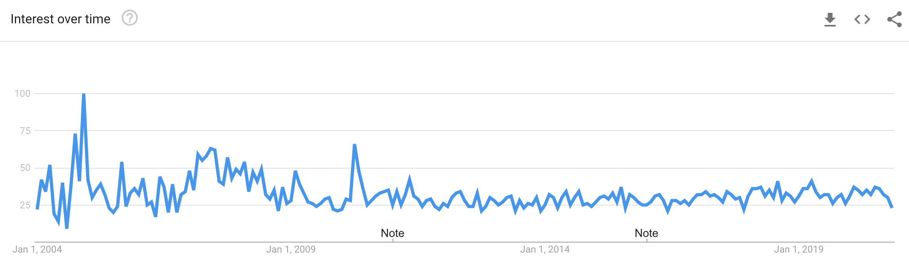

## Table of Contents <!-- omit in toc -->
1. [Introduction](#introduction)
2. [Why Behavior-driven development?](#why-behavior-driven-development)
3. [The Principles of Behavior-driven development](#the-principles-of-behavior-driven-development)
4. [From TDD to BDD](#from-tdd-to-bdd)
5. [The Tools of Behavior-driven development](#the-tools-of-behavior-driven-development)
6. [Advantages of Behavior-driven development](#advantages-of-behavior-driven-development)
7. [Conclusion](#conclusion)
8. [References](#references)

## Introduction
The ultimate goal for every agile process is to turn work into value in a sustainable way. In the context of software engineering, humans automate solutions to problems by explaining them in much detail to machines, that do not have a common sense. Thus, the machines can solve the automatable problems and humans can focus on the not automatable tasks: To further explain the right solutions to problems to a machine in the right way. This discipline is software engineering. The result of explaining the right solution to a machine the right way is good software. In all this there are (at least) two major problems:

1. Misunderstandings in inter-human communication

Often communication between people is required before software can be built, because in many cases some people have the skills to explain a solution to a machine, and other people have a deep understanding of the solution itself. The classical approach to to solve this problem is called specification.

2. Perceived functional dissonance of software

Sometimes people think that software works in a certain way but it doesn't. While or after building software, some features might work at some point in time and then break without humans recognizing it. The software might stop (or even worse: not stop) in critical, unexpected moments which can cost, depending on the software, a lot of customers, money or even lifes. The common approach to solve this problem is called quality assurance and contains testing the software repeatedly.

The effects of these problems need to be discovered. In a waterfall-based approach the feedback cycle closes only after an increment went through specification, implementation and quality assurance, which means, that if any increment went off track, it is discovered at a late point in time.

The fundamental idea of BDD is to focus on the behavior of a software system while moving the solutions to the above mentioned problems, specification and quality assurance, closer together.[@nagy2018discovery, p.3] Thereby, the feedback cycle shortens and off-track increments are harder to produce and less impactful. In this essay I want to elaborate on how BDD leverages this idea into building sustainable software, which principles and tools it uses to do so and to what extent it can be assumed that BDD works.

## Why Behavior-driven development?
The annual "State of Agile" Report started 2007 and provides since then insights into the application of agile methodologies and practices over a large range of different companies worldwide.
For the 14th State of Agile Report 1121 surveys were collected [@stateOfAgile14, p.5] and for the Report from 2015 even 3880 surveys where collected[@stateOfAgile10, p.2]. The survey is handed out to agile practicioners and executives. It is aimed to be representative in terms of localization, company size and industries and it exists since more than 12 years, therefore it might contain a convincing insight into the employment of BDD, at least among the companies that participated in the survey. This table of percental BDD employment per year shows a significantly growing application of BDD, especially since 2015 BDD appears to gain relevance each year except 2019.[@nagy2018discovery, p.9f]

|      Report       | BDD used by |    BDD listed as     |
| :---------------: | :---------: | :------------------: |
| [@stateOfAgile3]  |     7%      |     agile method     |
| [@stateOfAgile4]  |    None     |   agile technique    |
| [@stateOfAgile5]  |     9%      |   agile technique    |
| [@stateOfAgile6]  |     9%      |   agile technique    |
| [@stateOfAgile7]  |     10%     |   agile technique    |
| [@stateOfAgile8]  |     12%     |   agile technique    |
| [@stateOfAgile9]  |     9%      |   agile technique    |
| [@stateOfAgile10] |     10%     |   agile technique    |
| [@stateOfAgile11] |     16%     | engineering practice |
| [@stateOfAgile12] |     17%     | engineering practice |
| [@stateOfAgile13] |     22%     | engineering practice |
| [@stateOfAgile14] |     19%     | engineering practice |

BDD is listed under different captions: In the earlier surveys it was listed as an agile method, then it was listed as an agile technique and since 2016 it is listed as engineering practice.

// QUESTION: should I do this?
Another approach understand the interest in BDD is to have a look at Google Trends:

[@googleTrendsBddTopic]

This graphic visualizes the interest in BDD as topic over time relative to the past highest interest, in this case in December 2004, for Google web searches. The graphic displays some high interest from late 2004 until mid 2007, a peak in mid 2010 and since then a relative interest of around 30% until the present day. This appears odd and does not match the state of agile reports intuitively, assuming that people in the software industry use the Google web search to search for applied practices. One possible explanation is, that people in the software industry might be early adopters of alternatives to the Google web search.

## The Principles of Behavior-driven development
The term behavior-driven development, as it was introduced by Dan North in 2006[@north2006introducing-bdd], explicitly avoided the term "test" in order to keep business people engaged.[nagy2018discovery, p.10] This is a strong hint towards the most fundamental principle of BDD: bringing the specification and the quality assurance together or in other terms: "Bridging the Communication Gap", which is the title of the book by Gojko Adzic[@Adzic2009Bridging] that describes a very similar idea which he names "specification by example" and "agile acceptance testing".

## From TDD to BDD
Dan North describes in "Introducing BDD" how BDD is his response to TDD. In order to get a deeper understanding of what that means, we must have a closer look at TDD. TDD is a narrower approach, in which only technically focussed people are involved. The idea is to write a test that describes a feature which doesn't exist yet, ensure it fails, and then implement that feature until the test does not fail anymore. After the new test is executed successfully and none of the existing tests is broken, the developer can move on to the next test for the next feature. This test-first approach is mentioned in the early publications about Extreme Programming[@Lindstrom2004ExtremePA].

According to the agile alliance glossary[@agileAllianceTDD], common pitfalls of a TDD using team are a "poor maintenance of the test suite – most commonly leading to a test suite with a prohibitively long running time" which sometimes leads to a "abandoned test suite (i.e. seldom or never run)[...]". Dan North explains some further pitfalls, that range from the naming of the tests, which might cause some "false sense of security"[@north2006introducing-bdd], to the scope and the actual functionality that needs to be tested. Thinking in terms of behavior solved these issues: The naming of an executable test is based on the behavior it should assure. The scope of the test is easier defined on the level of behavior (rather on the more technical level of test), because a behavior describing sentence has naturally a certain length and a functional scope that excludes all technical details. The question, which features should be tested, also became easier to answer: All of the behavior, that the software should have, needs to be tested. Lower level tests, which ensure the software uses a specific solution, step back in order to focus on the behavior itself, which correlates to the original intent of writing the software.

- To what extent is BDD an advancement to test-driven development (TDD)?
  - TDD as origin
  - Differences & Similarities
  - Does BDD contain or extend TDD?
  - Do they solve the same problem?
  - Does the testing scope shift (Unit -> Acceptance tests)?
- Which goals are defined?
- Which areas are affected by BDD?
  - Specification - a contract?
    - Context(Given) Event(When) Outcomes(Then)
    - becomes executable
    - Scenarios
    - Gherkin language
    - by example (which enables making it executable) not in general
  - Quality Assurance
  - Development
  - Documentation
- Do the roles change?
  - Dev team is invited to participate in business discussions.
  - What about responsibility segregation?

## The Tools of Behavior-driven development
- Name a few examples like JBehave and/or Cucumber
- what do the tools do?
- importance of tools
 
## Advantages of Behavior-driven development
- motivation
  - Does devteam win by invitation to business participation?
  - Does a deeper (than a scrum user story) understanding of the business questions increase the dev team's motivation?
- specification
- business value
  - Five whys
- communications
  - Business experts can read the specification code (aka test code)
- coding
  - Does BDD prevent too much code or code that does too much and help focus on the actual requirements?
- quality assurance (getting closer to specification)
  - Do passing tests mean anything in terms of business value?
  - Is it more useful to have higher level tests than lower level unit tests? Are both testing levels required? Examples?
- documentation
  - Executable specification as living documentation

## Conclusion
- Qualitative
  - limitations
  - possibility (Useful aspects of BDD)
- Quantitative proof that BDD works?
- From the industry point of view: How can BDD be approached?
  - Is it possible to start with tech only or business only adoption, or does it have to happen simultaniously?
- Different layers of adoption
  - Consider: https://dzone.com/articles/the-five-stages-of-bdd-and-agile-adoption
  - What are the important understandings of each layer?
  - Which roles are involved & affected? What about the motivation of each of those roles?
  - Is it possible to quantify the adoption of BDD in terms of those layers?
- Does BDD work?
- Should everyone do BDD?

## References